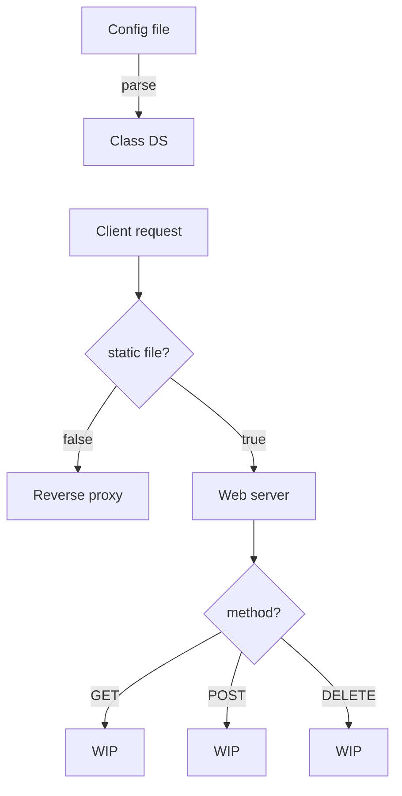

```mermaid

flowchart TB
    A["Config file"] -- parse --> B["Class DS"]
    B ~~~ C["Client request"]
    C --> D{"static file?"}
    D -- false --> E["Reverse proxy"]
    D -- true --> F["Web server"]
    F --> G{"method?"}
    G -- GET --> H["WIP"]
    G -- POST --> I["WIP"]
    G -- DELETE --> L["WIP"]
```